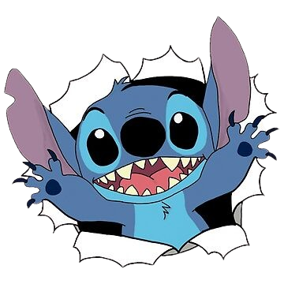

## Hi there! 👋

<table>
  <tr>
    <td>
      
    </td>
    <td>
       I'm a tech enthusiast who loves learning new things, solving problems, and exploring the latest  technologies. I enjoy creating projects that challenge my skills, sharing knowledge with others,  and contributing to open-source communities to help push innovation forward. My curiosity  drives me to experiment with new ideas, tools, and techniques, constantly looking for ways  to improve and expand my understanding. In the fast-moving world of technology, there’s  always something exciting to discover, and I love being part of that journey.
    </td>
  </tr>
</table>

---

| **Interests**                                | **Open Source Contributions**              | **Links**                                     |
|----------------------------------------------|--------------------------------------------|-----------------------------------------------|
| <ul><li>Coding :computer:</li><li>Chess ♟️</li><li>Taking naps 💤</li><li>And a lot of other cool things (ʘ.ʘ)╯</li></ul> | <ul><li>[Narwhals](https://github.com/narwhals-dev/narwhals) [~900 ★] - Documentation</li><li>[Mousam](https://github.com/amit9838/mousam) [~300 ★] - Bug Fix; Enhancement</li></ul> | <ul><li>[Website](https://georgescutelnicu.github.io)</li><li>[HuggingFace](https://huggingface.co/georgescutelnicu)</li><li>[Kaggle](https://www.kaggle.com/georgescutelnicu/code)</li></ul> |

 
 
 
 

I write code, break things, and sometimes… they even work! 
